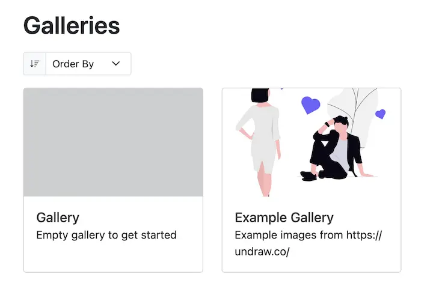
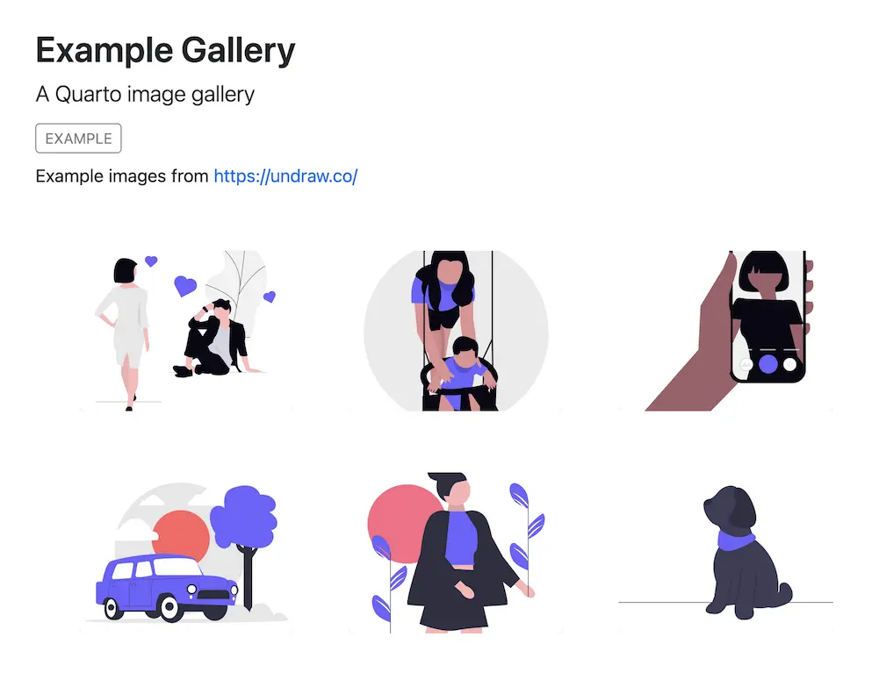

# Quarto image gallery

A Quarto extension/template for adding image galleries to your Quarto website. Put images in a directory, run `quarto render`, and you get an image gallery + a listing page of all your galleries to put on your website. Galleries and image views can be customised with Lightbox, see <https://quarto.org/docs/output-formats/html-lightbox-figures.html>.

- Source repo: <https://github.com/mvuorre/quarto-gallery>
- Live demo: <https://mvuorre.github.io/quarto-gallery/>

## Examples

### Listing of galleries

Here's what a listing of galleries looks like (it's just a vanilla Quarto listing):



### Gallery page

And here's what a gallery page looks like:



## Install

1. Add extension
```bash
quarto use template mvuorre/quarto-gallery
```
2. include `pre-render: generate-gallery.ts` in [`_quarto.yml`](_quarto.yml)
3. Create your gallery at `galleries/<name>/` with `index.qmd` and `images/<images.ext>`
    - See `galleries/my-gallery/` for an example
4. Edit `galleries/_metadata.yml` and `galleries.qmd` to your liking
5. `quarto render`
